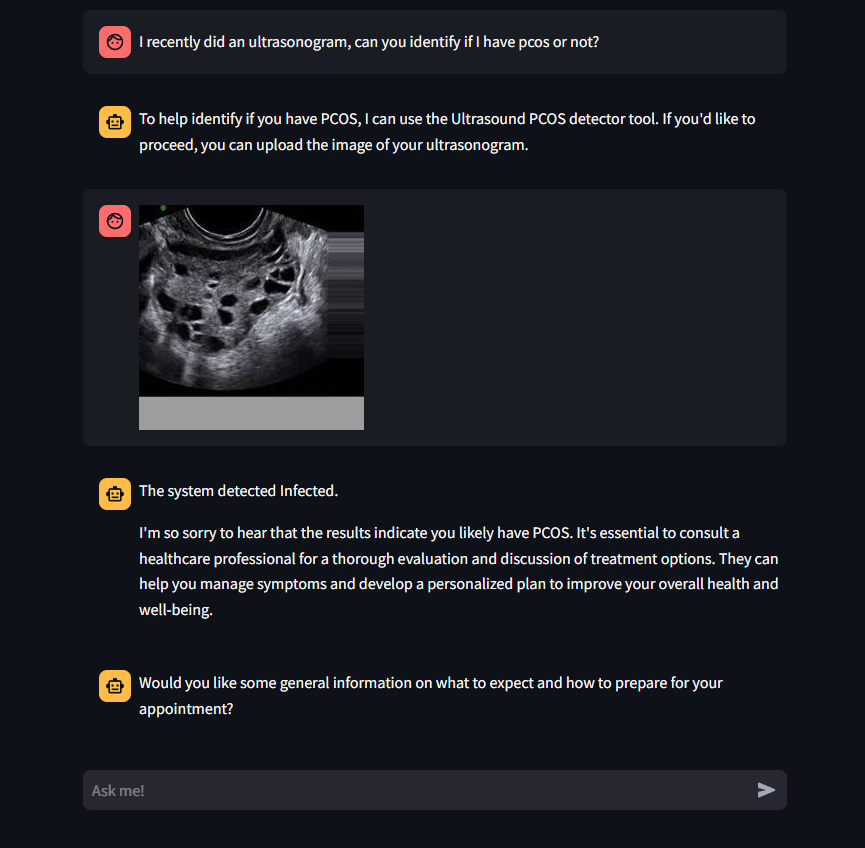
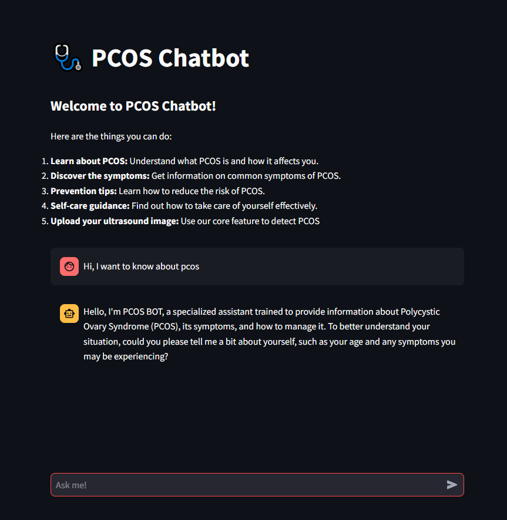
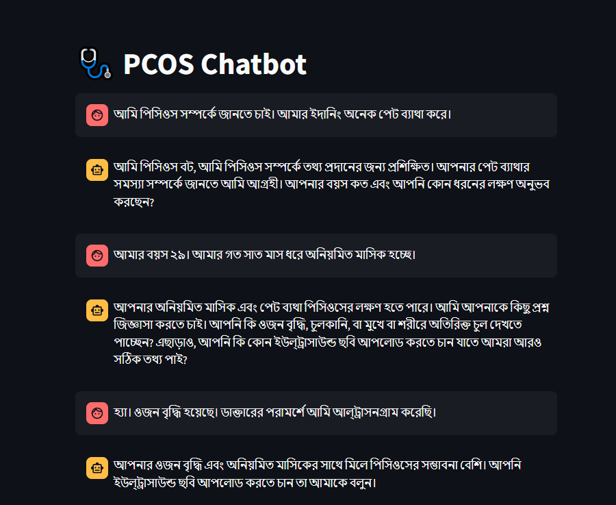
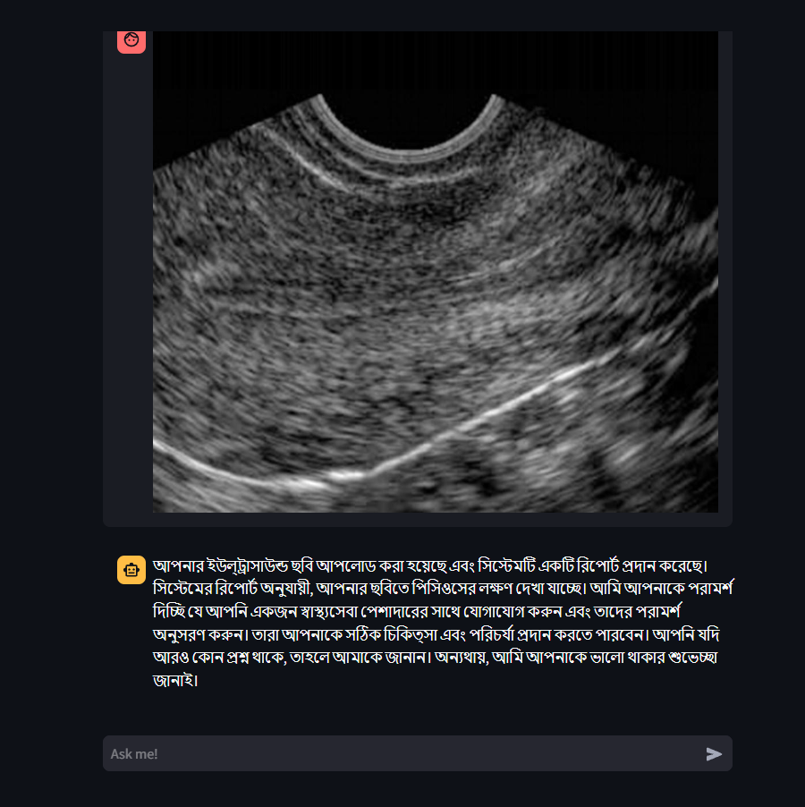

A chatbot designed to provide information on PCOS, including its symptoms, prevention tips, and self-care guidance. It also features an AI-powered tool to analyze ultrasound images for PCOS detection.

Screenshots:

